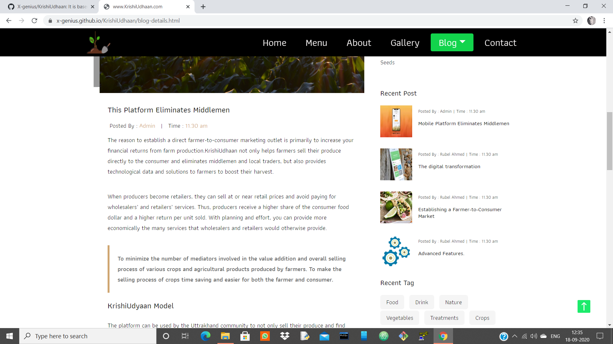

# KrishiUdhaan
Based on HTML5, CSS, Bootstrap.
This project is based on farming culture. In this project, I tried to remove the intermediators in agricultural processes, so that the farmers get the actual money for his/her product and buyers can also purchase his/her crop at less prices.

# Screen-Shots
# 1.Home page - Desktop view

# 2.Responsive ScreenShot

# 3.Menu - Which type of crops, fruits available on the website

# 4.About - Intro for our website

# 5.Gallery - Images of the fruits, crops etc.

# 6.Add google map to provide location of the farmer as well as Dairies

# 7.Blogs

